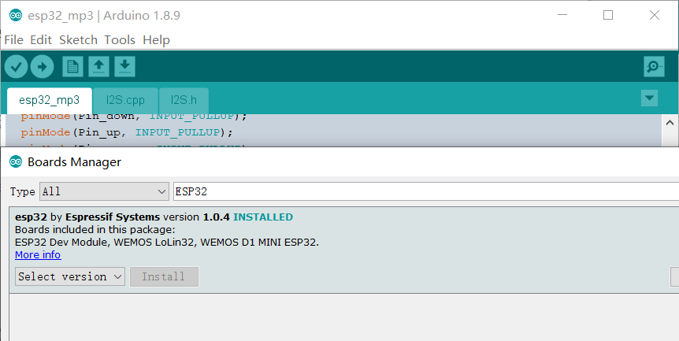
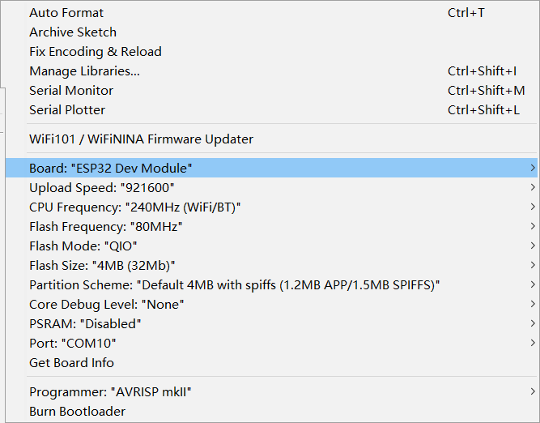
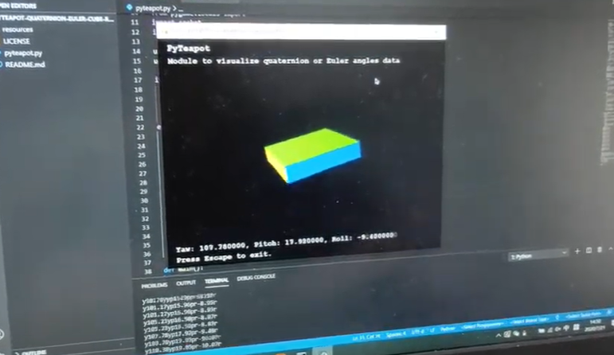

# ESP32_IMU_Module

```
/*
Version:		V1.1
Author:			Vincent
Create Date:	2020/7/22
Update Date；	2020/9/11
Note：
	V2.0:Add wiki link.Add a serial test exe.
	v1.1:Added the IMU documentation and PCB diagram.
*/
```


*The following two project were briefly modified.*

[PyTeapot-Quaternion-Euler-cube-rotation](https://github.com/thecountoftuscany/PyTeapot-Quaternion-Euler-cube-rotation)

[i2cdevlib](https://github.com/jrowberg/i2cdevlib)

[YouTube:6 Axis IMU Sensor with ESP32](https://www.youtube.com/watch?v=PJSM8G_pLW8&feature=youtu.be)

[toc]

# Overview

[Makerfabs home page](https://www.makerfabs.com/)

[Makerfabs Wiki](https://makerfabs.com/wiki/index.php?title=Main_Page)

Through the socket to achieve wifi transmission euler Angle, and display on the PC side of the Python program.To facilitate testing, I packaged a Win10 64-bit EXE program that can be accessed by changing the IP in the ESP32 program.Otherwise, you need to install a dependent library like OpenGL.


## Equipment list

- [ESP32 6- Axis IMU Wiki](https://www.makerfabs.com/wiki/index.php?title=ESP32_IMU) 


# Steps

## V2.0 Update:

- Now you can use USB cable connect to PC.
- Added serial port test program : "/ESP32_IMU_Module/imu_show_serial/dist/imu_show_serial_test.exe".
- WiFi transmission is not enabled by default.
- If WiFi transmission is required, the following code needs to be modified.  Uncomment before WIFI_CONNECT.

```c++
//#define WIFI_CONNECT
```


## PC

- If you're on Windows 64-bit, you can run "/ESP32_IMU_Module/imu_show/dist/imu_show.exe".
- Other platform can run "/ESP32_IMU_Module/imu_show/imu_show.py".(Dependency libraries such as OpenGL need to be installed manually)
- After run program,wait seconds.
- A line of native IP is displayed.
- Leave the Python program window still and prepare ESP32.

## ESP32

- Open "/ESP32_IMU_Module/mpu6050_wifi/mpu6050_wifi.ino"
- Change IP ,your Wifi ssid and password.

```c++
const char *ssid = "Makerfabs";
const char *password = "20160704";
const char *host = "192.168.1.117"; 
```

- Select Tools/Board/BoardsManager.
- Search esp32.
- Install esp32 by Espressif Systems.



- Select Toos/board/Esp32 Dev Modue.



- Connect ESP32 to your PC via Micro USB .
- Select Port.
- And at last ,push upload.

## Show On PC

- Once ESP32 is ready, it usually restarts automatically, and the Python window displays the mock up image.
- If there is no restart, you need to press RST to reboot manually.



