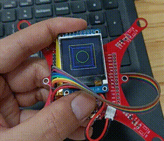

# ESP32_IMU_Module

```
/*
Version:		V2.1
Author:			Vincent
Create Date:	2020/7/22
Update Date；	2020/9/11
Note：
	V2.1:Make a Level-Tool. And put code into "./example".
	V2.0:Add wiki link.Add a serial test exe.
	v1.1:Added the IMU documentation and PCB diagram.
*/
```


*The following two project were briefly modified.*

[PyTeapot-Quaternion-Euler-cube-rotation](https://github.com/thecountoftuscany/PyTeapot-Quaternion-Euler-cube-rotation)

[i2cdevlib](https://github.com/jrowberg/i2cdevlib)

[YouTube:6 Axis IMU Sensor with ESP32](https://www.youtube.com/watch?v=PJSM8G_pLW8&feature=youtu.be)

[toc]

# Overview

[Makerfabs home page](https://www.makerfabs.com/)

[Makerfabs Wiki](https://makerfabs.com/wiki/index.php?title=Main_Page)

The Makerfabs IMU Module features the 6-axis MPU-6050 MEMS sensor from InvenSense. Each of these 6DoF IMU features an ESP32 with an MPU-6050 which contains a 3-axis gyroscope as well as a 3-axis accelerometer. The MPU-6050 uses 16-bit analog-to-digital converters (ADCs) for digitizing 6 axes. By combining a MEMS 3-axis gyroscope and a 3-axis accelerometer on the same silicon die together with an onboard Digital Motion Processor™ (DMP™). It can be used as a helicopter/quadcopter.


## Features

- Integrated ESP32 2.4G WiFi and Bluetooth
- I2C Digital-output of 6-axis MotionFusion data in rotation matrix, quaternion, Euler Angle, or raw data format
- Input Voltage: 3.7V Battery or 5.0V MicroUSB
- Tri-Axis angular rate sensor (gyro) with a sensitivity up to 131 LSBs/dps and a full-scale range of ±250, ±500, ±1000, and ±2000dps
- Tri-Axis accelerometer with a programmable full scale range of ±2g, ±4g, ±8g and ±16g
- Digital Motion Processing™ (DMP™) engine offloads complex MotionFusion, sensor timing synchronization and gesture detection
- Embedded algorithms for run-time bias and compass calibration. No user intervention required
- Digital-output temperature sensor
- Size: max 100mmX100mmX9mm

# Example

## MPU Cube

With a 1.44TFT LCD screen, a cube is shown following the MPU6050 motion. 

When the IMU is close to horizontal, a circular marker is displayed.



## MPU6050 Python Demo

Through the socket to achieve wifi transmission euler Angle, and display on the PC side of the Python program.To facilitate testing, I packaged a Win10 64-bit EXE program that can be accessed by changing the IP in the ESP32 program.Otherwise, you need to install a dependent library like OpenGL.

### V2.0 Update:

- Now you can use USB cable connect to PC.
- Added serial port test program : "/ESP32_IMU_Module/imu_show_serial/dist/imu_show_serial_test.exe".
- WiFi transmission is not enabled by default.
- If WiFi transmission is required, the following code needs to be modified.  Uncomment before WIFI_CONNECT.

```c++
//#define WIFI_CONNECT
```


### PC

- If you're on Windows 64-bit, you can run "/ESP32_IMU_Module/imu_show/dist/imu_show.exe".
- Other platform can run "/ESP32_IMU_Module/imu_show/imu_show.py".(Dependency libraries such as OpenGL need to be installed manually)
- After run program,wait seconds.
- A line of native IP is displayed.
- Leave the Python program window still and prepare ESP32.

### ESP32

- Open "/ESP32_IMU_Module/mpu6050_wifi/mpu6050_wifi.ino"
- Change IP ,your Wifi ssid and password.

```c++
const char *ssid = "Makerfabs";
const char *password = "20160704";
const char *host = "192.168.1.117"; 
```

- Select Tools/Board/BoardsManager.
- Search esp32.
- Install esp32 by Espressif Systems.


- Select Toos/board/Esp32 Dev Modue.


- Connect ESP32 to your PC via Micro USB .
- Select Port.
- And at last ,push upload.

### Show On PC

- Once ESP32 is ready, it usually restarts automatically, and the Python window displays the mock up image.
- If there is no restart, you need to press RST to reboot manually.


